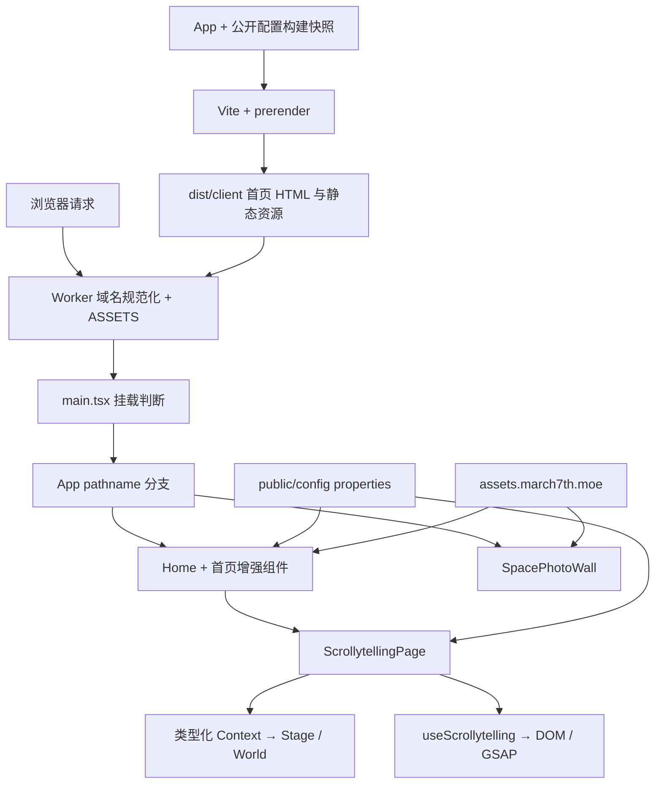

# 架构总览

## 系统定位与依赖方向

项目是内容展示站，没有接入用户账户、交易或业务 API。技术版本与命令以 [package.json](../../package.json) 和锁文件为准：React 19、Vite 8、严格模式 TypeScript、Tailwind CSS 4、GSAP/ScrollTrigger、typed.js，要求 Node.js ≥ 22.13.0。

## 责任与边界

| 范围 | 拥有的职责 | 不应推断出的能力 |
| --- | --- | --- |
| App / main | pathname 选择、首页 hydration、子页面独立挂载 | 没有通用路由器或服务端子页面渲染 |
| Home / 增强组件 | 角色内容、语录和首页交互 | 不拥有横向世界的逐帧进度 |
| Scrollytelling | 配置校验、连续世界、单一滚动时间轴 | HUD、Station 仍是展示，没有商店或任务业务 |
| SpacePhotoWall | RAF 驱动 CSS 3D、大图交互 | 不使用 Scrollytelling 时间轴或 WebGL |
| Worker / 构建 | 静态交付、域名规范化、首页预渲染 | D1 和示例 notes API 没有接入请求链 |

## 关键约束

- 首页 HTML 在构建时通过 React `renderToString` 生成；Worker 不做每次请求的 React SSR。浏览器 effect 必须保持服务端可导入。
- Scrollytelling 首次渲染使用与预渲染相同的配置快照，挂载后再请求公开配置。语录只在 effect 中加载，两者不是同一套解析器。
- Scrollytelling 的唯一 Master Timeline 限于 `#memories`；FormsScrollFade 自有 ScrollTrigger，相册自有 RAF。清理不得销毁其他模块的动画。
- World 不额外横移、不创建阻隔图层的 stacking context；设计面负责缩放，图层负责位移，插槽负责几何，motion wrapper 负责局部动画。
- `404-page` 与客户端 `/photo-wall` 分支存在交付缺口，详见[构建与路由流程](workflows/build-and-routing.md)。不能把开发服务器的回退当作生产路由契约。
- 首页、相册的 CDN 地址和部分参数目前仍在组件中；配置驱动是后续修改规则，不表示全部旧内容已经配置化。

## Relevant Source

[入口](../../app/main.tsx) · [App](../../app/App.tsx) · [Vite](../../vite.config.ts) · [预渲染](../../scripts/prerender.mjs) · [Worker](../../worker/index.ts) · [Wrangler](../../wrangler.jsonc) · [动画所有权](../../app/hooks/useScrollytelling.ts) · [D1 边界](../../db/index.ts)
